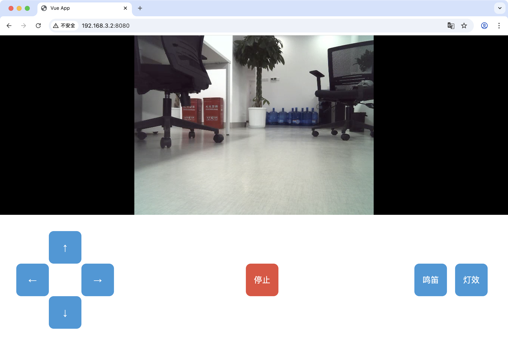

# skynet-web

**skynet-web** 是一个面向 **FPV（第一人称视角）智能小车** 的网页控制前端。

它支持在浏览器中远程观看摄像头画面，并通过网页 UI 控制小车的移动。

> ⚠️ 当前版本中，小车 **灯效控制功能暂不可用**。

------

## 功能特性 ✨

- 📹 **远程视频**：通过 WebRTC/WHEP 协议实时观看小车摄像头画面。
- 🎮 **小车控制**：支持前进、后退、转向、停止等操作（基于ROS 2 rosbridge）。
- 🌐 **跨平台访问**：任意设备（PC/平板/手机）浏览器即可使用。
- 🔌 **容器化部署**：基于 Docker Compose 一键运行。

------

## 安装与使用 🚀

1. **克隆仓库**

   ```bash
   git clone https://github.com/fleetime0/skynet-web.git
   cd skynet-web
   ```

2. **配置环境变量**

   在 docker-compose.yml 中修改以下地址：

   ```yaml
   services:
     skynet-web:
       image: ghcr.io/fleetime0/skynet-web
       container_name: skynet-web
       ports:
         - "8080:80"
       restart: unless-stopped
       environment:
         STREAM_URL: "http://192.168.3.2:8000/"
         ROS_BRIDGE_URL: "ws://192.168.3.2:9090/"
   ```

   - STREAM_URL

     对应 **视频流地址**，需要使用 [ros2_skynet](https://github.com/fleetime0/ros2_skynet) 项目中 webrtc_whep 节点提供的 WHEP URL。

   - ROS_BRIDGE_URL

     对应 **rosbridge_server** 的 WebSocket 地址，例如 ws://<ROS主机IP>:9090/。

------

## 使用效果 🎥

在浏览器中访问服务地址（如 http://192.168.3.2:8080/），即可看到如下界面：



- 左侧方向键：控制小车前进 / 后退 / 左转 / 右转。
- 中间按钮：是否控制小车。
- 右侧按钮：鸣笛、灯效（当前版本暂不可用）
- 上方：实时摄像头画面（通过 WebRTC/WHEP 传输）

------

## 项目依赖 🔗

skynet-web 需要搭配 [ros2_skynet](https://github.com/fleetime0/ros2_skynet) 使用：

- 负责视频流推送（WebRTC WHEP 服务）
- 提供 ROS 2 rosbridge_server 接口

请先部署 ros2_skynet，再运行 skynet-web。详细说明参考 [ros2_skynet ](https://github.com/fleetime0/ros2_skynet)。
